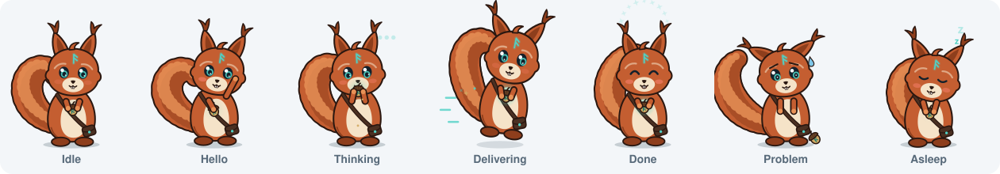

# Ratatoskr

Ratatoskr is the Toskar mascot, and Toskar takes its name from him. In the myth he is the squirrel who runs up and down Yggdrasil, the World Tree, carrying messages between the eagle at the top and Níðhöggr at the roots. Toskar does a similar job, carrying requests between apps and the models on your computers.

## Files

| File | What it is |
| --- | --- |
| `ratatoskr-prototype.html` | Working prototype. Open it in a browser. The rig is the `Squirrel` class at the bottom of the script. Use it as the reference when porting. |
| `ratatoskr-states.svg` | All seven states side by side, for docs and reviews. |
| Stills | For a still of any one state, open the prototype and copy that tile's `<svg>` element. Use stills where animation isn't possible, such as the README, the site, or OS notifications. |

## How the rig works

He is one inline SVG, drawn in code with no image files.

- **Tail:** 18 circles placed along a jointed chain. Each frame, the chain is rebuilt from four values: `tailA` (start angle), `curl0`, `curl1` (how tightly it curls toward the tip) and a sway wave (`swayAmp`, `swayF`).
- **Arms:** stroked lines from a shoulder to a paw point, so a paw can go anywhere.
- **Ears, head, eyes, mouth, acorn:** each has its own transform or opacity.
- **States:** each state is a function `(t) => partial pose`. Every frame the rig eases the current pose toward the target, so switching states blends smoothly.
- **One-shot motion:** the acorn drop in `error` and the jump in `success` use `DIRECT` keys. These follow the target exactly instead of easing toward it.
- **Built-in behavior:** blinks, ear twitches and particles (sparks, crumbs, z's) run inside the rig.

## States and where they go

| State | Meaning | Trigger | Where it goes | Size |
| --- | --- | --- | --- | --- |
| `idle` | The daemon is up and nothing is queued. | Default state. | **Chat landing hero** in `features/chat/ChatPage.tsx` (the `.chat-landing-hero` block, above the composer). **Boot splash** in `components/ServiceBootGate.tsx` (`BootSplash`), next to or in place of the pulsing mark. **Empty states** through `components/ui/EmptyState.tsx` (add an optional `mascot` prop). | 96 px landing and empty states, 160 px boot |
| `greet` | First run. | Onboarding steps before `done`. | `features/onboarding/OnboardingPage.tsx`, the page header area. | 160 px |
| `think` | A model is working on a reply. | From sending a chat until the first `chat.token`, and during `tool.started` and `plan.step`. | `features/chat/ChatActivity.tsx`. Replace the three `chat-activity-dot` spans with a 32 px mascot. Keep the label and `role="status"`. | 32 px |
| `deliver` | Work is going to a paired computer. | A `scheduler.placement` event naming a remote node, or a deploy running from `features/nodes/DeployModelsPanel.tsx`. | Inline in `ChatActivity` when the reply runs on a peer. Also the header of `features/nodes/NodesPage.tsx` while a deploy is running. | 32 px inline, 96 px page |
| `success` | Something finished. Plays once (1.8 s), then returns to `idle`. | `model.download.completed`, `training.deployed`, `node.paired`, or the onboarding `done` step. | `features/models/ModelCard.tsx` or `InstalledTab.tsx` after a download. `features/train/TrainPage.tsx` after deploy. `OnboardingPage.tsx` on the `done` step. | 64 to 96 px |
| `error` | Something failed. Holds its final pose. | `chat.error`, `model.download.failed`, `task.failed`, a failing Heimdall check, or boot timing out. | `features/chat/ChatErrorCard.tsx`, `features/chat/ModelFailureNotice.tsx`, the top of `features/diagnostics/DiagnosticsPage.tsx` when a check fails, and `BootFailed` in `ServiceBootGate.tsx`. | 48 px in cards, 96 px pages |
| `sleep` | No model is loaded. | The running-models query returns an empty list, for example after the idle sweeper unloads a model. Also the desktop shell's `stopping` lifecycle event. | Empty state of `features/models/RunningTab.tsx`. The "Closing Toskar" overlay in `components/LifecycleHost.tsx`. | 96 px |

### Rules of thumb

- Show at most one mascot per view. He marks moments and shouldn't sit on every page as decoration.
- Use him alongside text, never in place of it. Each spot keeps its existing label or message, and the SVG is `aria-hidden`.
- Don't recolor him. Copper fur reads on both themes, and teal is kept for his eyes and runes.
- Minimum size is 24 px. Below 48 px, turn off blinking and particles; the prototype already does this.

## Porting plan

1. **Component:** add `web/src/components/ui/Ratatoskr.tsx`, exporting `<Ratatoskr state="idle" size={96} />`.
   - Port the `Squirrel` class as-is into `web/src/lib/ratatoskr/rig.ts`, and make it framework-free.
   - The component creates the rig in a `useEffect`, calls `setState` when the prop changes, and destroys the rig on unmount.
2. **Animation loop:** run one shared `requestAnimationFrame` loop for every mounted rig.
   - Pause a rig when it is offscreen (IntersectionObserver) or when `document.hidden` is true.
3. **Reduced motion:** with `prefers-reduced-motion: reduce`, show a still pose.
4. **Screenshot mode:** the CSS rule `html[data-screenshot='1']` does not stop JavaScript animation. The rig has to check `readScreenshotLaunch()` itself and render a fixed frame, so `make screenshots` stays deterministic.
5. **State hook:** add `useMascotState()`, which reads the event stream (`lib/events.ts`) and React Query state and returns the current state for each spot. One-shot states (`success`) should time out back to `idle`.
6. **Optional backend change:** emit a `model.unloaded` event from `internal/models/lifecycle/sweeper.go` when it stops an idle model, and add it to `KNOWN_EVENT_TYPES`. Without this event, `sleep` comes from the running-models query.
7. **Brand:** list Ratatoskr as a brand asset in `TRADEMARKS.md`, the same way as the logo.
8. **Tests:** cover the state hook's event mapping and the reduced-motion and screenshot-mode stills.
